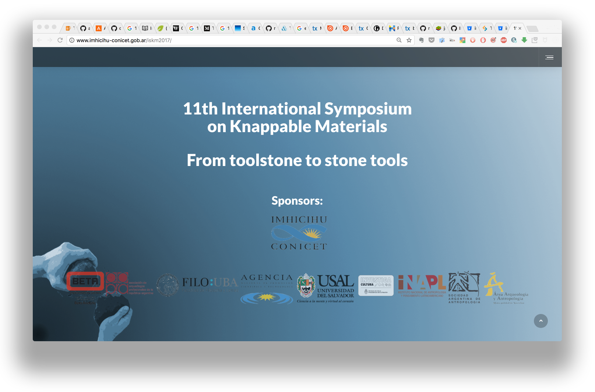
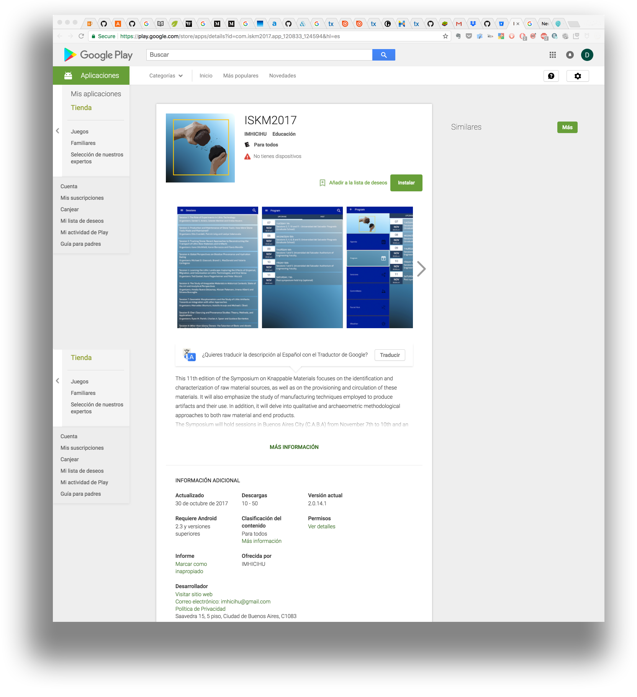

# Rationale #

* Workflow / Seminal Project: A native, mobile and the official app related with the [ISKM 2017 Symposium](http://www.imhicihu-conicet.gob.ar/iskm2017/) celebrated on Buenos Aires, Argentina, on november 2017.

### What is this repository for? ###

* ~~Hybrid Web-App - App -~~ Native Android App
* Version 1.1

### How do I get set up? ###

* Summary of set up
     - Lots of tools and the interaction between all of them. Implies hardware (real and virtual) and software (mostly open-source)
* Configuration
     - Android Studio
     - NPM
     - Bower 
     - Java 
     - Docker 
     - Android File Transfer
     - mobile emulators (Bluestack, mainly), 
     - [Frameworks](https://bitbucket.org/imhicihu/iskm2017-mobile-app/issues/edit/15) 

* Dependencies
	- [NPM](https://www.npmjs.com/)

* How to run the code
     - Go to Play Store. [Download for free](https://play.google.com/store/apps/details?id=com.iskm2017.app_120833_124594&hl=es).    
      
      
* Deployment instructions
     - ~~Download from this repo or our _Github_ account the .IPA or .APK. Then~~ Install it on your device. Run it. _Presto_.
     - Installation of the application is not possible. The [application life cycle](https://www.couchbase.com/blog/application-development-life-cycle/#:~:text=The%20application%20development%20life%20cycle%20(ADLC)%20is%20the%20process%20of,deployment%2C%20testing%2C%20and%20maintenance.) has reached its end.

### Changelog ###

* Please check the [Commits](https://bitbucket.org/imhicihu/iskm2017-mobile-app/commits/) link for the current status

### Code of Conduct

* Please, check our [Code of Conduct](code_of_conduct.md)

### Legal ###

* All trademarks are the property of their respective owners. 
